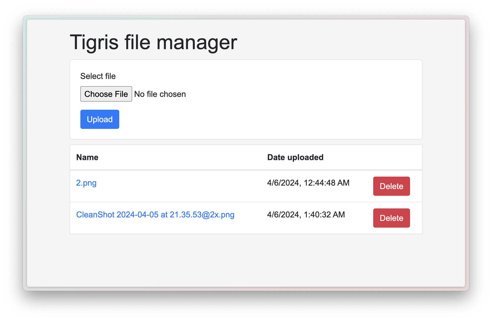

# Tigris Go Quickstart

This project is a simple web application that demonstrates how to upload files to a Tigris storage bucket and manage them. It is an HTTP server written in Go that serves up a single web page, preconfigured to deploy to Fly.io.

All of the code in _main.go_ is heavily commented to better help you understand what each section is doing.



## What is Tigris

Tigris is a globally distributed, S3-compatible object storage service that provides low-latency access to files.

Learn more at [tigrisdata.com](https://www.tigrisdata.com/).

## How to deploy this project

This project is designed to be easily deployed to Fly.io.

> Before you get started, make sure you have a [Fly.io](https://fly.io) account and the fly CLI installed on your computer.

Start by cloning the project to your computer:

```
git clone [repo url here]
```

Open the repository in the editor of your choice. Since all applications on Fly need to be globally unique, change the value of `app` in the _fly.toml_ file before attempting to deploy:

``` toml
# ...
app = 'tigris-go-quickstart' # Update this
# ...
```

Once updated, run the following command to configure the app in your Fly account, accepting the defaults when prompted:

``` bash
fly launch
```

Take note of the URL to access your app:

```
Visit your newly deployed app at https://{APP_NAME}.fly.dev/
```

Before you can access the app, you'll need to configure the Tigris storage bucket. Run the following command to create the bucket and set the necessary environment variables on your Fly app. Accept the defaults when prompted.

``` bash
fly storage create
```

Now navigate to the URL from the previous step and you should be presented with the app.
